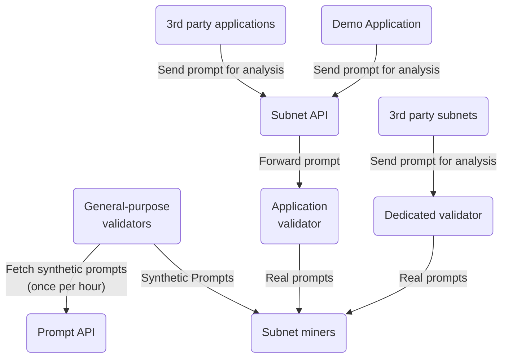
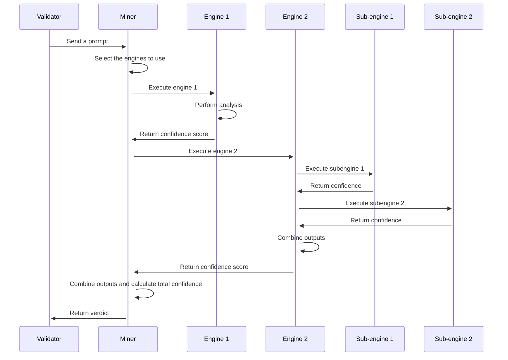

# LLM-Defender-Subnet Developer Guide
## Fundamentals
The the following diagram displays the high-level target architecture for version 1.0

    subgraph Maintained by the subnet owners 
        end
The synthetic prompts are used as a part of the scoring algorithm to determine which miners the application validator trusts the most when serving the real prompts received through the subnet API. The subnet API provides third party application developers a way to integrate their solutions in to the subnet. 

Third party subnets (or applications) can also query the miners through a dedicated validator they are hosting themselves. Having a dedicated validator serves the same purpose as using the subnet API, but the subnet API is meant to be used by people not within the Bittensor ecosystem.

The miners execute **analyzers** that are implementing a specific **capability**. For example, the capability to detect prompt injections is implemented by the prompt injection analyzer. Each analyzer consists of multiple **engines** and every engine can consist of multiple **sub-engines**.

Multiple engines (or sub-engines) are needed to cover multiple different detection methods for achieving the desired capability. A single method can be too prone for false-positives but by combining the results from multiple engines we can increase the confidence of the analysis significantly. For example, a vector search or YARA rules can be extremely efficient for detecting prompt injections that are based on known character sequences, but previously unknown prompt injections can be nearly impossible to detect with these methods.

The following sequence diagram provides a high-level overview on how the miner is expected to handle a prompt from a validator. The sequence is the same whether the prompt is a synthetic prompt or a real prompt.

Miners have two recommended methods for fine-tuning:

**(1) Enhancing the engines**

The engines in their default state are configured to provide relatively generic responses. The development efforts (at this point of time) are put on creating a modular and scalable platform the subnet participants can build on top of. Once version 1.0 is reached the aim is to focus on building better out-of-the-box engines and additional analyzers to provide the subnet new capabilities third party developers can better utilize. 

**(2) Adjusting the engine weights**

The default implementation weights all of the engines equally. Miners may want to specialize on select engines and thus it would make sense to change the weights for the engines, meaning that the output from a specific engine is given higher weight when calculating the overall score.

The recommended fine-tuning methods are described better in the fine tuning guide. 

## Contributing
There are two preferred ways you can contribute to the project:
1) Enhancing the default engines or;
2) Adding completely new sub-engines to existing engines.

Contributions to the high-level architecture, protocol and neuron templates are also appreciated but before you start working on a new feature you may want to have a chat with the project maintainers, as they may be working on something that makes your work redundant. That being said, once we reach version 1.0, all subsequent planned feature addition and architectural changes will be documented in GitHub issues.

## Bittensor 
### Scoring
### Gating
### Penalties 